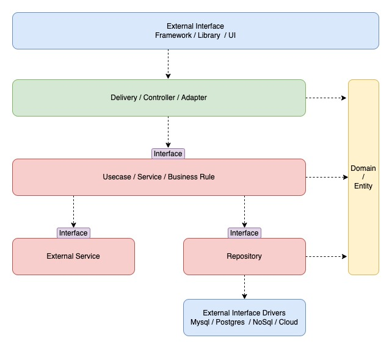

# go-clean-architecture
Codebase for golang use clean architecture


## Overview
The purpose of the codebase is to show:
- Independent of Frameworks
- Testable
- Independent of UI
- Independent of Database
- Independent of any external agency

More at [https://blog.cleancoder.com/uncle-bob/2012/08/13/the-clean-architecture.html](https://blog.cleancoder.com/uncle-bob/2012/08/13/the-clean-architecture.html)

## Content
- [Quick start](#quick-start)
- [Project structure](#project-structure)
- [Tools Used](#tools-used)

## Quick start
Build Local development:
```bash
cd go-clean-architecture
git submodule update --init --force --remote
docker compose build
```

Start development:
```bash
# Copy env
cp .env.example .env

# Start docker
docker compose up -d

# Inside docker
docker compose exec go-app bash

# Make migrate
make create_example_table.sql

# Migrate
go run cmd/migrate/main.go

# Run seed data
go run cmd/seed/main.go

# Start http server
air -c cmd/app/.air.toml

# Check lint
make lint

# Make mock file
make build-mock

# Check Unit test
make test

# Check with CURL
curl -X POST 'localhost:8080/api/register' \
 -H 'accept: application/json' \
 -H 'content-type: application/json' \
 -d '{
    "email": "user@example.com",
    "password" : "password",
    "role_id": 1,
    "name": "user"
}'

curl -X POST 'localhost:8080/api/login' \
 -H 'accept: application/json' \
 -H 'content-type: application/json' \
 -d '{
    "email": "user@example.com",
    "password" : "password"
}'
```

## Project structure


This application is divided into 2 layers, internal and pkg:
- Internal is Business logic
- Pkg is tools (logs, database, utils,...)

The communication between layers


```
    Delivery >  usecase (interface)
                usecase (interface) > repository (interface)
                usecase (interface) < repository (interface)
    Delivery <  usecase (interface)
```


For Internal application use 4 domain layers:

### `Entities`:
Entities of business logic (models) can be used in any layer.

Entities are simple data structures:
```go
// Path internal/domain/role.go
// Role entity
type Role struct {
    ID        uint      `json:"id"`
    Name      string    `json:"name"`
    Slug      string    `json:"slug"`
    CreatedAt time.Time `json:"created_at"`
}
```

### `Repositories`:
A repository is an abstract storage (database) that business logic works with. Layer responsibility will choose DB use in application
```go
// RoleRepository represent the role's usecases
type RoleRepository interface {
    Fetch(context.Context) ([]Role, error)
}
```

### `Usecase`:
This layer contains application specific business rules. This a layer decide repository will use
```go
// RoleUsecase represent the role's repository contract
type RoleUsecase interface {
    Fetch(context.Context) ([]Role, error)
}
```

### `Delivery`:
This a layer will decide how the data present. Could be REST API, HTML, or gRPC whatever the decide type.
```go
// Path: internal/modules/role/delivery/http

// roleHandler represent the httphandler
type roleHandler struct {
    Usecase domain.RoleUsecase
}

// NewHandler will initialize the roles/ resources endpoint
func NewHandler(e *echo.Echo, uc domain.RoleUsecase) {
    handler := &roleHandler{
        Usecase: uc,
    }

    g := e.Group("/api")
    g.GET("/roles", handler.Index)
}

// Index will fetch data
func (hl *roleHandler) Index(c echo.Context) error {
    ctx := c.Request().Context()
    roles, _ := hl.Usecase.Fetch(ctx)

    return c.JSON(http.StatusOK, roles)
}
```

## Tools Used
- [https://gorm.io](https://gorm.io)
- [validator](https://github.com/go-playground/validator)
- [spf13/viper](https://github.com/spf13/viper)
- [golang/mock](https://github.com/golang/mock)
- [Echo](https://echo.labstack.com)
- [cosmtrek/air](https://github.com/cosmtrek/air)
